# OCStudio

OCStudio to aplikacja webowa do tworzenia, organizowania i opisywania postaci. Projekt pozwala budować własne szablony postaci, przypisywać postacie do folderów, zarządzać statusami oraz korzystać z panelu administracyjnego. Aplikacja została przygotowana jako projekt PHP + PostgreSQL uruchamiany w Dockerze.

## Spis Treści

- [Funkcje](#funkcje)
- [Społeczność i Publikacje](#społeczność-i-publikacje)
- [Screeny Aplikacji](#screeny-aplikacji)
- [Technologie](#technologie)
- [Architektura](#architektura)
- [Struktura Projektu](#struktura-projektu)
- [Uruchomienie](#uruchomienie)
- [Konta i Role](#konta-i-role)
- [Baza Danych](#baza-danych)
- [Backup Bazy](#backup-bazy)
- [Flow Aplikacji](#flow-aplikacji)
- [Najważniejsze Widoki](#najważniejsze-widoki)
- [Bezpieczeństwo i Prywatność](#bezpieczeństwo-i-prywatność)
- [Zasady Wyglądu i Grafik](#zasady-wyglądu-i-grafik)
- [Responsywność](#responsywność)
- [Eksport Bazy do Pliku SQL](#eksport-bazy-do-pliku-sql)
- [Testy i Dane Demo](#testy-i-dane-demo)
- [Dalszy Rozwój](#dalszy-rozwój)

## Funkcje

- Rejestracja i logowanie użytkowników.
- Sesja użytkownika oraz zabezpieczenie widoków wymagających logowania.
- Dashboard z podsumowaniem konta.
- Tworzenie, edycja, duplikowanie i usuwanie postaci.
- Organizowanie postaci w folderach.
- Zmiana nazwy folderu i usuwanie folderu po potwierdzeniu nazwą.
- Przenoszenie postaci między folderami.
- Wyszukiwanie postaci i folderów.
- Statusy postaci: `Do zrobienia`, `W trakcie`, `Gotowa`.
- Filtrowanie i przypisywanie filtrów do postaci.
- Tworzenie własnych szablonów postaci.
- Obsługa różnych typów pól w szablonach postaci:
  - tekst,
  - długi tekst,
  - lista,
  - wybór z listy,
  - zdjęcie,
  - galeria zdjęć,
  - tabela,
  - data.
- Podgląd postaci w formie strony opisowej.
- Warianty postaci.
- Upload grafik postaci.
- Domyślna grafika dla trybu jasnego i ciemnego.
- Eksport postaci do PDF i TXT:
  - aktualny wariant,
  - cała postać z wariantami,
  - masowy eksport widocznych postaci do jednego pliku albo paczki ZIP.
- Galeria zdjęć z prywatnym dostępem do plików przez kontroler mediów.
- Historie oraz tablice relacji powiązane z postaciami.
- Usuwanie postaci, folderów, historii, relacji i szablonów po potwierdzeniu nazwą; zdjęcia wymagają potwierdzenia kodem `123456`.
- Ustawienia wyglądu:
  - light mode,
  - dark mode,
  - wybór koloru akcentu,
  - liczba kolumn w widoku postaci,
  - język interfejsu.
- Ustawienia konta:
  - zmiana nazwy użytkownika, hasła, emaila, imienia i nazwiska,
  - kontrola widoczności imienia i nazwiska,
  - eksport i import archiwum konta.
- Panel admina:
  - lista użytkowników,
  - informacje o liczbie postaci,
  - informacja o zajętym miejscu,
  - blokowanie konta,
  - planowanie usunięcia konta,
  - cofanie zaplanowanego usunięcia,
  - zwijane sekcje panelu,
  - przełączniki funkcji strony,
  - tryb offline na wskazanym koncie,
  - dynamiczne typy kont,
  - limity miejsca na zdjęcia per typ konta,
  - wyłączanie funkcji konkretnym typom kont,
  - tabela filtrów i aliasów językowych,
  - zapis i import backupu oraz przypomnienia o kolejnej kopii.
- Społeczność:
  - eksplorowanie publicznych publikacji,
  - katalog publicznych profili,
  - publikowanie postaci, szablonów, zdjęć, historii i relacji,
  - reakcje, komentarze, zgłoszenia i kopiowanie treści,
  - followy, blokady i powiadomienia.
- Profil użytkownika:
  - publiczny opis,
  - avatar profilowy,
  - lista aktualnie udostępnionych publikacji,
  - wejście na profil przez kliknięcie nicku lub kafelka użytkownika.
- Chat w prawym dolnym rogu aplikacji.
- Wybór języka interfejsu: polski i angielski.
- System liczenia zajętości plików użytkownika.
- Profesjonalna strona błędu 404.
- Responsywny interfejs z trybem mobilnym i menu burger.

## Społeczność i Publikacje

OCStudio ma rozbudowaną część społecznościową, ale prywatna praca użytkownika nadal pozostaje prywatna. Do społeczności trafia tylko wybrany snapshot publikacji. Autor może dalej edytować oryginalną postać, historię, szablon, zdjęcie albo tablicę relacji bez zmiany publicznego widoku. Publiczna wersja zmienia się dopiero po świadomym odświeżeniu publikacji.

Najważniejsze zasady publikowania:

- publikacja jest osobnym publicznym stanem treści,
- można opublikować tylko wybrany wariant postaci,
- inne warianty oraz prywatna wersja podstawowa nie są widoczne publicznie,
- publikacje można aktualizować albo cofnąć,
- skopiowana publikacja trafia na konto użytkownika jako prywatna kopia, a nie jako nowa publikacja,
- historie i tablice relacji nie ujawniają prywatnych postaci; ukryte nazwy są zastępowane znacznikiem `UKRYTE`,
- skopiowane treści mogą zachować informację o oryginalnym autorze, jeżeli autor nie wyłączył atrybucji w ustawieniach.

Udostępniane typy treści:

- postacie i konkretne warianty postaci,
- szablony postaci,
- zdjęcia z galerii,
- historie,
- tablice relacji.

Widok `Społeczność` służy do eksplorowania publicznych treści i profili. Wyszukiwanie korzysta z jednego rzędu przycisków-segmentów:

- zakres: wszystko, treści, użytkownicy, obserwowani, moje publiczne,
- typ publikacji: wszystkie typy, postacie, historie, zdjęcia, relacje, szablony,
- sortowanie ikonami: malejąco, rosnąco albo losowo.

Lista użytkowników pokazuje tylko profile, które mają publiczne publikacje i włączoną promocję profilu w ustawieniach. Sortowanie użytkowników bazuje na liczbie publikacji, a sortowanie treści bazuje na liczbie reakcji. Tryb losowy daje mniej popularnym treściom szansę pojawienia się wyżej.

Kliknięcie publikacji w społeczności albo na profilu nie przenosi od razu na osobną stronę. Aplikacja przyciemnia aktualny widok i otwiera pełnoekranowy modal z podglądem publikacji. Nawigacja, header i chat pozostają pod spodem, więc po zamknięciu podglądu użytkownik wraca dokładnie do miejsca, w którym był. Bezpośredni adres `/p/{publicId}` nadal działa jako normalna strona publikacji.

Publiczne publikacje mają layout dopasowany do typu treści:

- zdjęcia mają duży centralny podgląd obrazu oraz panel boczny z autorem, reakcjami, zgłoszeniem, opisem, filtrami i komentarzami,
- postacie pokazują mini podgląd postaci zgodny z układem szablonu,
- historie pokazują opis, pola historii i zredagowane odniesienia do prywatnych postaci,
- szablony pokazują pola lewej strony i infoboxu podobnie jak edytor szablonu, ale bez możliwości edycji,
- tablice relacji pokazują publiczny podgląd relacji w układzie zapisanym przez autora, z możliwością przesuwania oraz przybliżania i oddalania bez edycji.

Profile publiczne są dostępne pod `/u/{username}`. Kliknięcie nicku autora otwiera profil jako normalną stronę aplikacji, nie wewnątrz modala publikacji. Profil pokazuje opis, avatar, statystyki i aktualnie udostępnione treści użytkownika. Własny profil ma ten sam układ, ale pozwala edytować opis profilu i zdjęcie profilowe.

Interakcje społecznościowe:

- reakcje w formie 5 emotek,
- komentarze pod publikacjami,
- blokada dodawania tego samego komentarza wiele razy pod tą samą publikacją,
- zgłaszanie publikacji do moderacji,
- obserwowanie użytkowników,
- powiadomienia o nowych publikacjach obserwowanych osób, komentarzach, reakcjach, zgłoszeniach, moderacji i wiadomościach,
- blokowanie użytkowników w interakcjach,
- chat w prawym dolnym rogu, który nie resetuje rozmowy przy przechodzeniu między widokami.

Elementy należące do aktualnie zalogowanego użytkownika są oznaczane kolorem akcentu wybranym w ustawieniach. Skopiowane treści mają ikonę kopii; jeżeli kopia pochodzi od aktualnego użytkownika, ikona również dostaje jego kolor akcentu.

## Screeny Aplikacji

Screeny pokazują aktualny układ aplikacji po rozbudowie o widoki społecznościowe, profil, chat, galerię, relacje oraz przebudowany panel admina.

### Logowanie

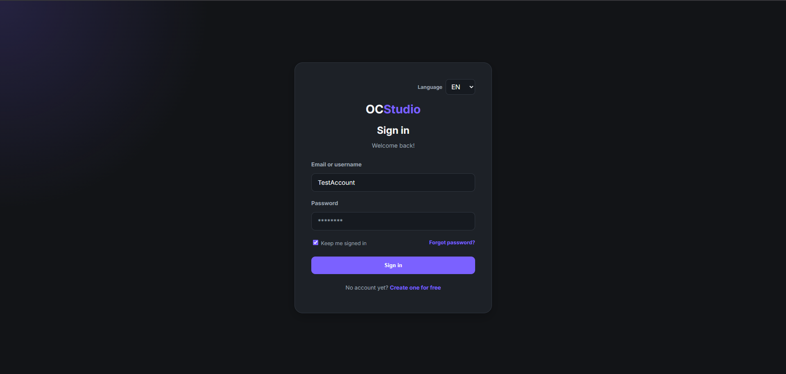

### Rejestracja

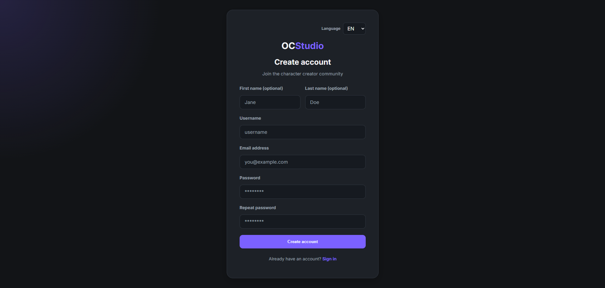

### Dashboard

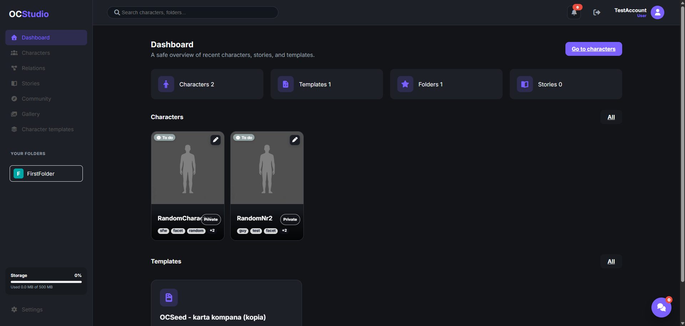

### Lista Postaci + Folderów

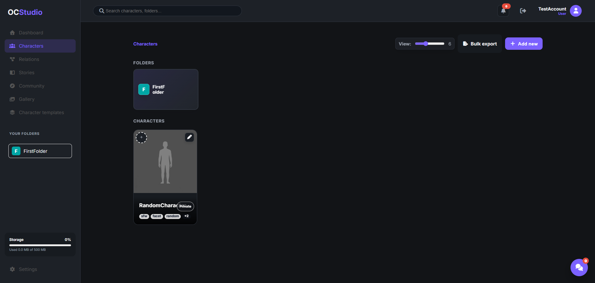

### Tworzenie Postaci

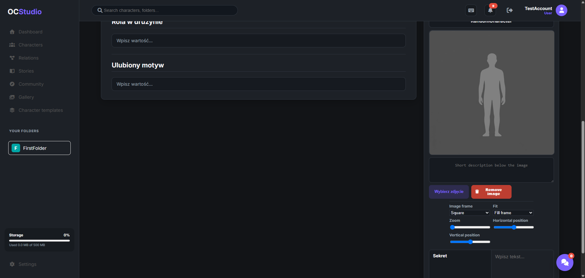

### Podgląd Postaci

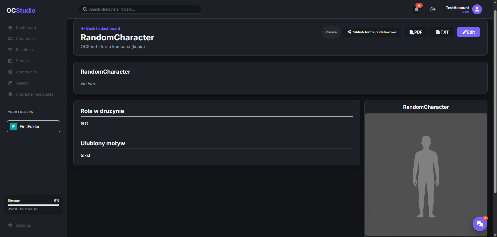

### Szablony postaci

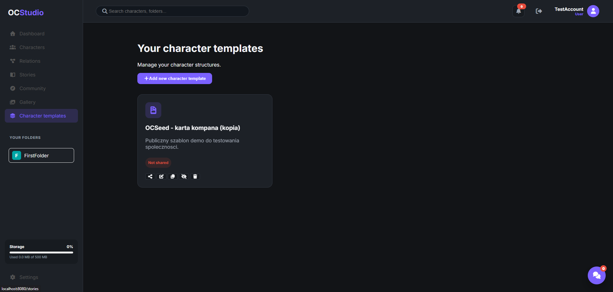

### Kreator Szablonu postaci

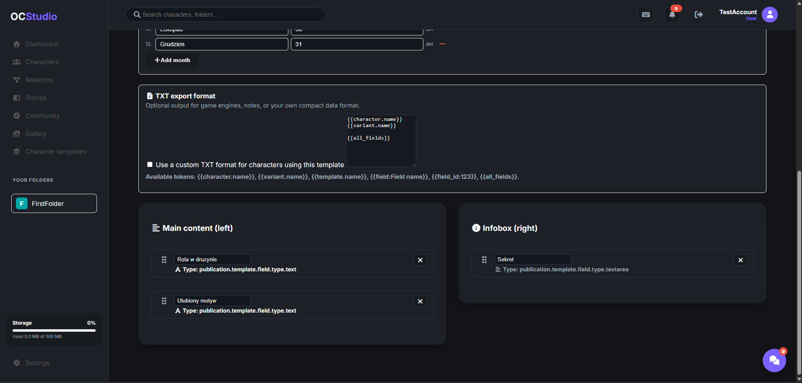

### Ustawienia

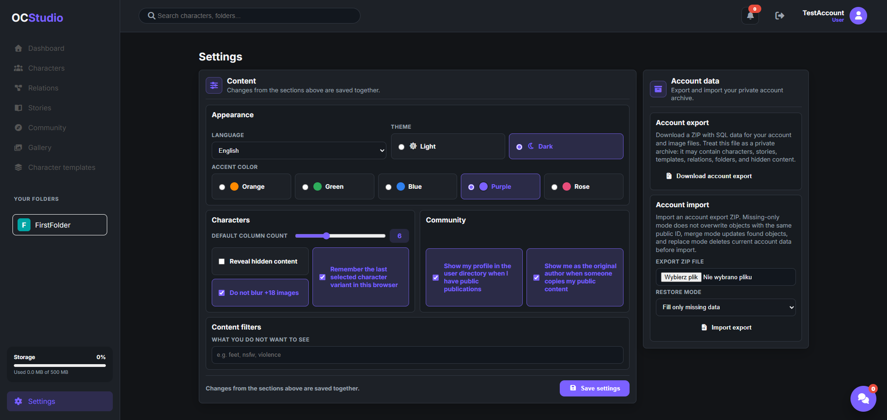

### Panel Admina

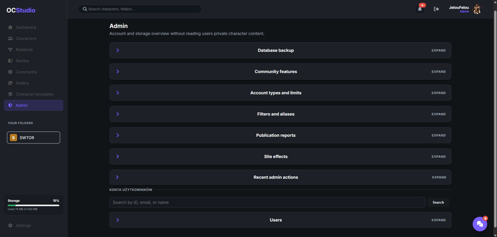

### Widok Mobilny

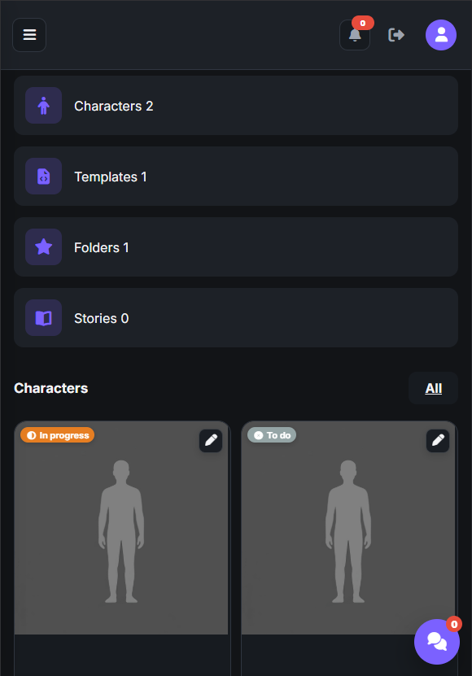

### Społeczność

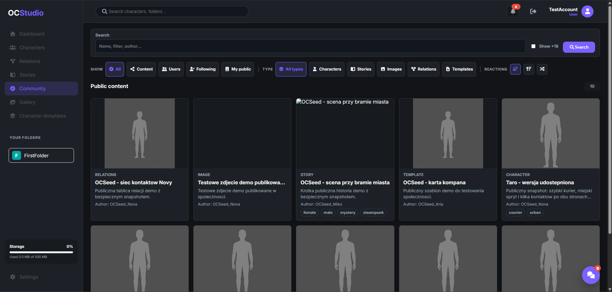

### Profil użytkownika

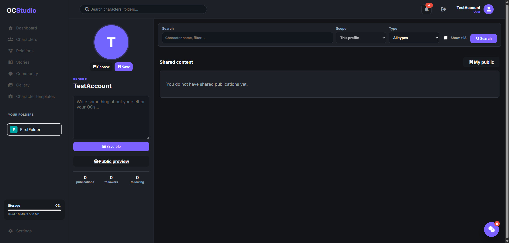

### Opublikowana treść

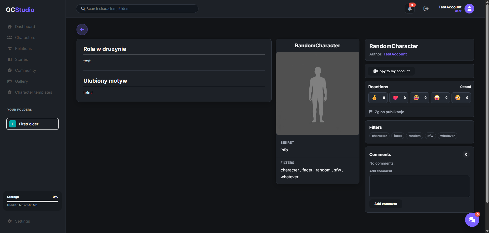

### Przeglądanie cudzej publikacji

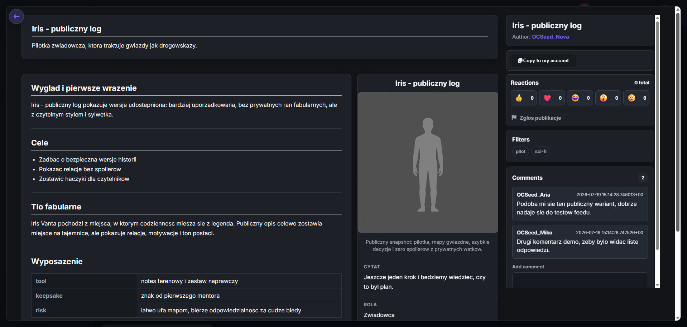

### Chat i powiadomienia

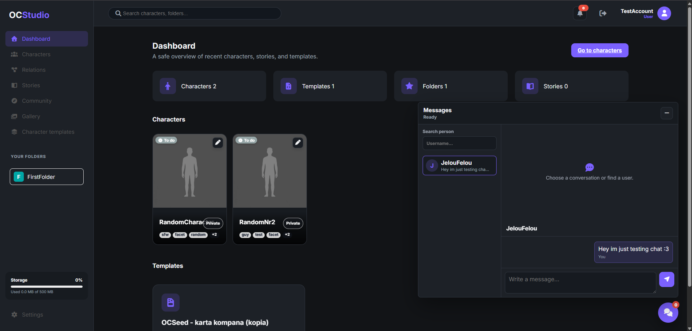

### Edytor relacji

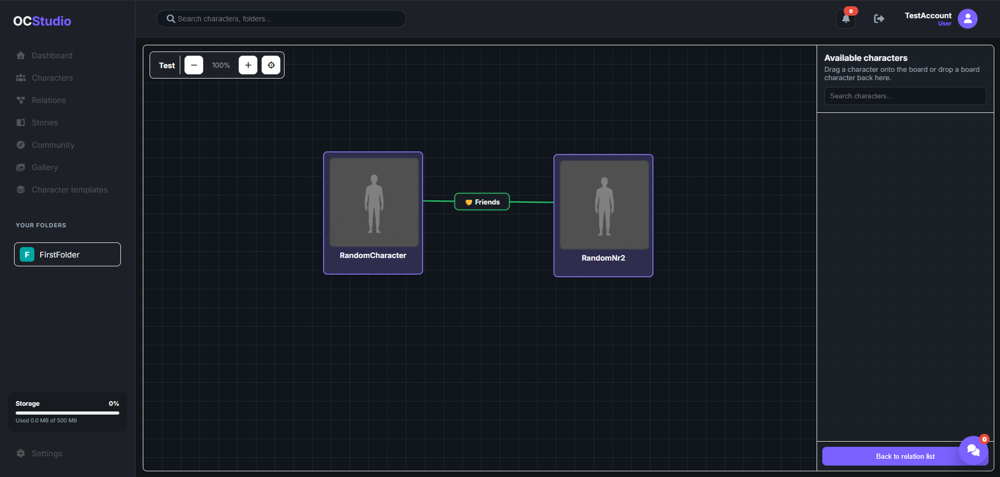

### Historie

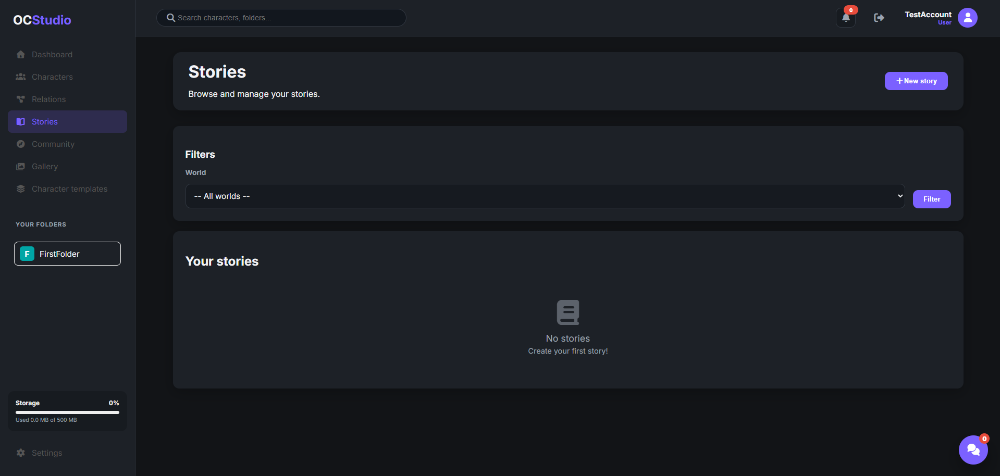

### Galeria

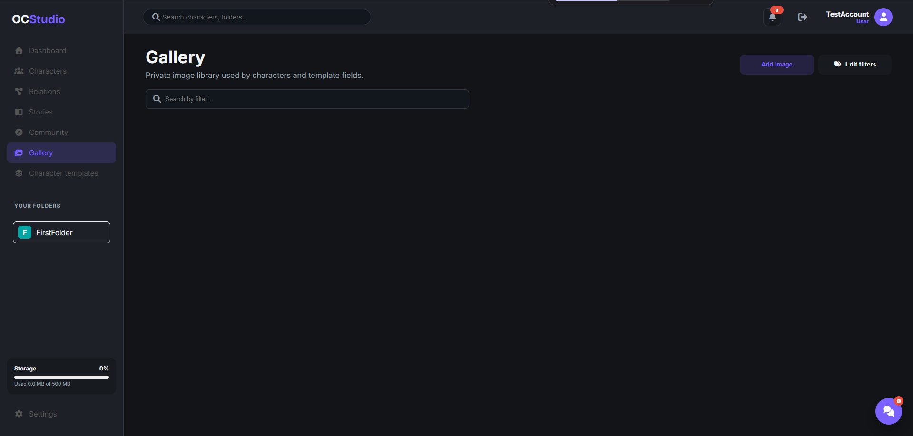

## Technologie

- PHP
- PostgreSQL
- Docker
- Docker Compose
- Nginx
- HTML
- CSS
- JavaScript
- Fetch API / AJAX
- Font Awesome
- pgAdmin

## Architektura

Projekt jest zorganizowany w stylu MVC:

- `controllers` odpowiadają za obsługę żądań HTTP i wybór odpowiednich widoków,
- `models` reprezentują dane używane w aplikacji,
- `repositories` odpowiadają za komunikację z bazą danych,
- `views` zawierają szablony HTML,
- `public/scripts` zawiera logikę JavaScript,
- `public/styles` zawiera style aplikacji,
- `docker` zawiera konfigurację kontenerów.

Routing aplikacji znajduje się w pliku `Routing.php`. Po otrzymaniu ścieżki aplikacja wybiera odpowiedni kontroler i akcję.

## Struktura Projektu

```text
.
├── docker/
│   ├── db/
│   │   ├── Dockerfile
│   │   ├── init/
│   │   │   └── init.sql
│   │   └── migrations/
│   ├── nginx/
│   └── php/
├── public/
│   ├── scripts/
│   ├── styles/
│   ├── uploads/
│   └── views/
├── scripts/
│   ├── backup_database.ps1
│   ├── migrate.php
│   ├── security_smoke.php
│   └── seed_social_demo.php
├── src/
│   ├── controllers/
│   ├── models/
│   ├── repositories/
│   └── services/
├── config.php
├── Database.php
├── docker-compose.yaml
├── index.php
├── README.md
└── Routing.php
```

## Uruchomienie

### Wymagania

- Docker
- Docker Compose

### Start Aplikacji

W głównym folderze projektu uruchom:

```powershell
docker compose up --build
```

Po uruchomieniu aplikacja jest dostępna pod adresem:

```text
http://localhost:8080
```

pgAdmin jest dostępny pod adresem:

```text
http://localhost:5050
```

Dane logowania do pgAdmin:

```text
Email: admin@example.com
Hasło: admin
```

### Dane Połączenia z Bazą

```text
Host w Dockerze: db
Port w kontenerze: 5432
Port lokalny: 5433
Baza: db
Użytkownik: docker
Hasło: docker
```

## Konta i Role

Aplikacja obsługuje typ konta zapisany w tabeli `users` w kolumnie `account_type`. Znaczenie tej liczby jest definiowane w tabeli `account_types`, dzięki czemu admin może dodać własne typy kont, np. `Premium`, `Tester` albo role techniczne.

```text
0 - User
1 - Admin
```

Domyślnie użytkownik ma typ konta `0`. Jeżeli baza nie ma jeszcze żadnego użytkownika, formularz rejestracji pokazuje opcje utworzenia pierwszego konta jako administratora albo jako konta trybu offline. Tryb offline automatycznie nadaje pierwszemu kontu uprawnienia admina i wyłącza klasyczne logowanie.

Typ konta można nadać z panelu admina przy karcie użytkownika. Konto administratora można też nadać ręcznie w bazie danych:

```sql
UPDATE users
SET account_type = 1
WHERE email = 'adres@email.pl';
```

Panel admina jest dostępny dla typów kont oznaczonych jako adminowe. Wbudowany `Admin` zostaje typem chronionym, a aplikacja nie pozwala przypadkowo odebrać dostępu ostatniemu administratorowi. Limity miejsca na zdjęcia są ustawiane per typ konta, domyślnie `500 MB`.

## Baza Danych

Schemat bazy danych znajduje się w pliku:

```text
docker/db/init/init.sql
```

Najważniejsze tabele:

- `users` - konta użytkowników,
- `account_types` - typy kont, limity miejsca i informacja, czy typ daje dostęp admina,
- `account_type_feature_permissions` - uprawnienia funkcji dla konkretnego typu konta,
- `templates` - szablony postaci,
- `template_fields` - pola w szablonach postaci,
- `characters` - postacie,
- `character_field_values` - wartości pól postaci,
- `character_variants` - warianty postaci,
- `character_variant_field_values` - wartości pól wariantów,
- `worlds` - foldery użytkownika,
- `character_statuses` - statusy postaci,
- `filters` - filtry,
- `filter_aliases` - aliasy i tłumaczenia filtrów,
- `character_filters` - przypisanie filtrów do postaci,
- `world_filters` - przypisanie filtrów do folderów,
- `user_blocked_filters` - filtry ukryte przez użytkownika,
- `image_assets` i `image_asset_filters` - prywatna galeria oraz tagi zdjęć,
- `content_filters` - uniwersalne powiązania filtrów z treściami,
- `stories`, `story_fields`, `story_field_values`, `story_characters` - historie i ich pola,
- `story_character_pseudonym_mapping` - publiczne pseudonimy i ukrywanie nazw postaci w historiach,
- `relation_boards`, `relation_tree_nodes`, `character_relations` - tablice relacji i połączenia między postaciami,
- `site_effect_settings` i `site_effect_dates` - efekty strony sterowane datami,
- `social_feature_settings` - przełączniki funkcji strony, tryb offline i limity miejsca,
- `publications` - publiczne publikacje treści,
- `publication_revisions` - kolejne snapshoty publicznych publikacji,
- `publication_comments` - komentarze pod publikacjami,
- `publication_reactions` - reakcje użytkowników,
- `publication_reports` - zgłoszenia publikacji,
- `publication_media` - powiązania publikacji z obrazami,
- `publication_filters` - snapshot filtrów publikacji,
- `notifications` - powiadomienia aplikacyjne,
- `conversations` i `messages` - prywatne rozmowy użytkowników,
- `user_follows` i `user_blocks` - obserwowanie oraz blokady interakcji między użytkownikami,
- `admin_activity_logs` - historia działań administracyjnych.

### Widoki, Funkcje i Wyzwalacze SQL

W pliku `docker/db/init/init.sql` znajdują się dodatkowe elementy bazy danych:

- `user_account_summary` - widok raportowy podsumowujący konto użytkownika. Zwraca dane użytkownika oraz liczbę jego postaci, szablonów postaci i folderów.
- `is_account_currently_banned(banned_until TIMESTAMP WITH TIME ZONE)` - funkcja SQL sprawdzająca, czy konto jest aktualnie zablokowane.
- `set_default_username_from_email()` - funkcja wyzwalacza ustawiająca domyślną nazwę użytkownika na podstawie części emaila przed `@`, jeżeli `username` jest pusty.
- `trg_set_default_username_from_email` - wyzwalacz uruchamiany przed dodaniem lub aktualizacją użytkownika, korzystający z funkcji `set_default_username_from_email()`.

Przykładowe użycie widoku i funkcji:

```sql
SELECT * FROM user_account_summary;

SELECT email, is_account_currently_banned(banned_until) AS is_banned
FROM users;
```

### Diagram ERD

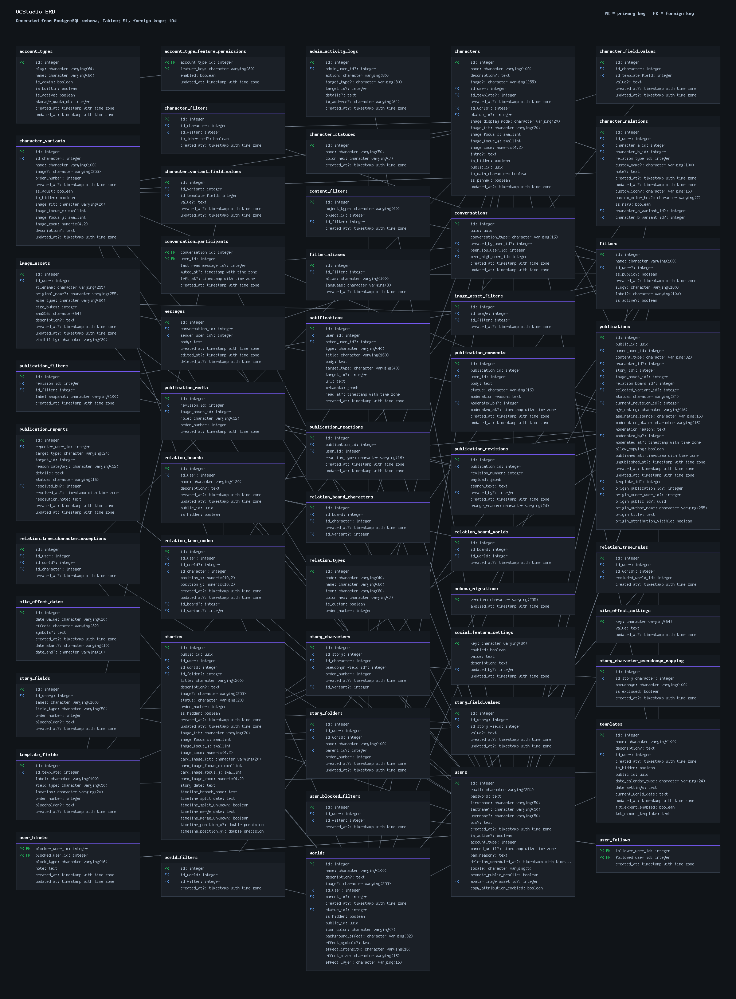

Diagram można odświeżyć z aktualnego schematu PostgreSQL komendą:

```bash
docker compose exec -T -w /app php php scripts/generate_erd.php
```

Generator czyta wyłącznie metadane schematu bazy: tabele, kolumny, klucze główne i klucze obce. Nie eksportuje prywatnych danych użytkowników.

## Backup Bazy

Backup bazy danych jest operacją administracyjną, ponieważ pełny eksport SQL może zawierać prywatne dane użytkowników. Panel admina pozwala zapisać kopię, odtworzyć globalny backup oraz ustawić przypomnienie o kolejnej kopii. Dostęp do tej sekcji powinien być traktowany ostrożnie i używany wyłącznie do zabezpieczenia lub awaryjnego odtworzenia systemu.

### Backup z Panelu Admina

Sekcja `Backup bazy danych` w panelu admina zawiera trzy bloki:

- `Zapis kopii` - tworzy aktualny backup bazy,
- `Odtwarzanie` - importuje globalny backup i może nadpisać dane systemu,
- `Przypomnienia` - pozwala ustawić, czy panel ma przypominać o backupie i co ile dni.

Przypomnienie nie uruchamia automatycznego backupu. Informuje administratora, że minął ustawiony czas od ostatniej zapisanej kopii.

### Backup Manualny

W głównym folderze projektu:

```powershell
mkdir backups
$stamp = Get-Date -Format "yyyyMMdd_HHmmss"
docker compose exec -T db pg_dump -U docker db > "backups\ocstudio_db_$stamp.sql"
```

Folder `backups/` jest dodany do `.gitignore`, więc pliki backupu nie trafiają do repozytorium.

### Backup Skryptem

Można użyć gotowego skryptu:

```powershell
powershell -ExecutionPolicy Bypass -File scripts/backup_database.ps1
```

Skrypt zapisuje plik SQL w folderze `backups/`.

### Przywracanie Backupu

Przykład przywrócenia backupu:

```powershell
docker compose exec -T db psql -U docker db < "backups\ocstudio_db_backup.sql"
```

Przywracanie należy wykonywać ostrożnie, ponieważ może zmienić lub zdublować dane w aktualnej bazie.

## Flow Aplikacji

1. Użytkownik trafia na ekran logowania. Może zalogować się, przejść do rejestracji albo użyć uproszczonego resetu hasła.
2. Po rejestracji dane konta są walidowane, hasło jest hashowane, a użytkownik wraca do logowania.
3. Po poprawnym logowaniu aplikacja zapisuje dane użytkownika w sesji i przekierowuje go do dashboardu.
4. Dashboard pokazuje podsumowanie konta: liczbę postaci, folderów, szablonów postaci oraz losowe postacie wymagające uwagi.
5. Użytkownik tworzy szablon postaci, czyli zestaw pól opisujących dany typ postaci. Szablon może zawierać pola tekstowe, listy, galerie, tabele, daty i pola wyboru.
6. Podczas tworzenia postaci użytkownik wybiera szablon postaci, uzupełnia pola, dodaje obraz, warianty oraz opcjonalnie przypisuje postać do folderu.
7. Lista postaci pozwala filtrować, wyszukiwać, przypisywać statusy, przenosić postacie między folderami, duplikować je i usuwać po potwierdzeniu nazwą.
8. Widok podglądu prezentuje gotową kartę postaci na podstawie wybranego szablonu oraz zapisanych wartości pól. Z tego miejsca można pobrać PDF albo TXT dla aktualnego wariantu lub całej postaci.
9. Użytkownik może opublikować wybrany wariant postaci albo inne typy treści. Publikacja zapisuje publiczny snapshot, więc dalsza prywatna edycja nie zmienia publicznej wersji, dopóki autor jej nie odświeży.
10. Sekcja `Społeczność` pozwala wyszukiwać publiczne treści i profile, filtrować wyniki po zakresie oraz typie publikacji, sortować je po popularności albo losowo.
11. Kliknięcie publikacji w społeczności albo na profilu otwiera pełnoekranowy modal nad aktualną stroną. Bezpośredni link `/p/{publicId}` nadal działa jako osobna strona.
12. Kliknięcie nicku autora otwiera publiczny profil `/u/{username}` jako normalną stronę aplikacji.
13. Użytkownicy mogą reagować, komentować, zgłaszać publikacje, kopiować publiczne treści, obserwować autorów i blokować interakcje z wybranymi osobami.
14. Chat w prawym dolnym rogu pozwala pisać do innych użytkowników bez resetowania okna przy przechodzeniu między widokami.
15. Ustawienia pozwalają zmienić motyw jasny/ciemny, kolor akcentu, język interfejsu, liczbę kolumn, profil publiczny, avatar i preferencje społecznościowe.
16. Administrator po zalogowaniu ma dostęp do panelu admina, gdzie może blokować konta użytkowników, planować lub cofać usunięcie konta, moderować zgłoszone publikacje, zarządzać funkcjami strony, typami kont, limitem miejsca per typ konta oraz aliasami filtrów.
17. Po wyłączeniu logowania aplikacja działa w trybie offline na wskazanym koncie admina. Społeczność, profil, powiadomienia, wylogowanie i chat są wtedy ukryte oraz blokowane po stronie endpointów.
18. Lista postaci pozwala wykonać masowy eksport widocznych postaci do jednego pliku PDF/TXT albo do osobnych plików spakowanych w ZIP.
19. Wylogowanie kończy pracę z aplikacją i usuwa aktywną sesję użytkownika, o ile aplikacja nie działa w trybie offline.

## Najważniejsze Widoki

### Logowanie i Rejestracja

Użytkownik może założyć konto i zalogować się do aplikacji. Hasło jest zapisywane w bazie w formie zahashowanej.

### Dashboard

Widok startowy po zalogowaniu. Pokazuje podstawowe informacje o koncie i szybki dostęp do najważniejszych sekcji.

### Postacie

Główna sekcja pracy z postaciami. Użytkownik może:

- tworzyć postacie,
- edytować postacie,
- duplikować postacie,
- usuwać postacie po potwierdzeniu nazwą,
- przypisywać statusy,
- przypisywać filtry,
- przenosić postacie do folderów,
- wyszukiwać postacie.

### Foldery

Foldery służą do porządkowania postaci. Usunięcie folderu przenosi postacie do głównego widoku, zamiast usuwać je razem z folderem.

### Szablony postaci

Szablony postaci pozwalają zdefiniować strukturę danych dla postaci. Dzięki temu różne typy postaci mogą mieć różne pola.

Szablon może mieć włączony format eksportu TXT. Autor szablonu wpisuje wtedy własny schemat tekstowy z placeholderami pól, danych postaci i danych wariantu. Dzięki temu ten sam system postaci może służyć np. do szybkiego tworzenia opisów NPC, prostych baz tekstowych albo danych przenoszonych do zewnętrznych narzędzi.

### Kreator Szablonu postaci

Kreator pozwala dodawać pola po lewej stronie opisu lub w infoboxie. Na urządzeniach mobilnych pola można przesuwać przyciskami góra/dół oraz przenosić między sekcjami.

### Podgląd Postaci

Widok prezentuje postać na podstawie wybranego szablonu postaci oraz zapisanych danych. Prywatne postacie są dostępne tylko dla właściciela konta.

Podgląd zawiera eksport do PDF i TXT. Przyciski `PDF` oraz `TXT` pozwalają wybrać, czy pobrać tylko aktualny wariant, czy całą postać z wariantami. PDF zachowuje wygląd zbliżony do ustawień aplikacji, korzysta z motywu, koloru akcentu, portretu postaci, pól infoboxu oraz obrazów z pól szablonu.

### Społeczność

Widok społeczności jest centrum publicznych treści. Zamiast klasycznych rozwijanych list używa przycisków-segmentów w jednym rzędzie:

- `Pokaż` wybiera zakres wyników,
- `Typ` zawęża publikacje do postaci, historii, zdjęć, relacji albo szablonów,
- ikony sortowania zmieniają kolejność na malejącą, rosnącą albo losową.

Publikacje są pokazywane jako kafelki z obrazem, typem treści, tytułem, opisem, autorem i filtrami. Własne treści są oznaczane kolorem akcentu użytkownika. Kopie mają ikonę kopiowania, a kopie pochodzące od aktualnego użytkownika dostają dodatkowe wyróżnienie kolorem akcentu.

Kliknięcie kafelka publikacji otwiera modalowy podgląd nad aktualną stroną. Tło aplikacji zostaje przyciemnione, ale nav, header i chat pozostają na miejscu pod spodem. Dzięki temu użytkownik nie traci kontekstu wyszukiwania ani filtrów.

### Publiczne Publikacje

Publikacje mają różne układy zależnie od typu treści. Nie każdy typ jest renderowany tak samo:

- zdjęcia mają duży centralny podgląd obrazu oraz panel boczny z informacjami i interakcjami,
- postacie pokazują mini podgląd postaci zgodny z układem szablonu,
- historie pokazują opis, pola historii i zredagowane odniesienia do prywatnych postaci,
- szablony pokazują pola lewej strony i infoboxu podobnie jak edytor szablonu,
- tablice relacji pokazują publiczny układ zapisany przez autora oraz pozwalają przesuwać, przybliżać i oddalać podgląd bez edycji.

Podgląd publikacji zawiera autora, reakcje, zgłoszenie, opis, filtry i komentarze. Nick autora prowadzi do profilu publicznego jako normalnej strony aplikacji, nie jako kolejnego widoku wewnątrz modala.

### Profile Użytkowników

Profil publiczny jest dostępny pod `/u/{username}`. Pokazuje avatar, opis, statystyki i aktualnie udostępnione publikacje użytkownika. Profil własny ma ten sam ogólny układ, ale pozwala edytować opis oraz zdjęcie profilowe.

Użytkownik może zdecydować w ustawieniach, czy jego profil ma być promowany w katalogu użytkowników. Profil bez publicznych publikacji albo z wyłączoną promocją nie pojawia się w katalogu społeczności.

### Galeria

Galeria służy do zarządzania zdjęciami. Zdjęcia mogą być przesyłane z komputera albo wybierane z istniejącej galerii tam, gdzie formularz wymaga obrazu. Zdjęcie z galerii można udostępnić jako osobną publikację społecznościową.

### Historie i Relacje

Historie oraz tablice relacji mogą być publikowane w społeczności. Jeżeli historia albo relacja odwołuje się do postaci, która nie została publicznie udostępniona, jej nazwa nie jest ujawniana i zostaje zastąpiona znacznikiem `UKRYTE`.

### Chat i Powiadomienia

Chat znajduje się w prawym dolnym rogu aplikacji. Otwiera małe okno rozmowy i nie resetuje aktywnej rozmowy podczas przechodzenia między widokami.

Powiadomienia informują o komentarzach, reakcjach, nowych publikacjach obserwowanych użytkowników, wiadomościach, zgłoszeniach oraz decyzjach administracji. Użytkownik może oznaczyć wszystkie powiadomienia jako przeczytane i dostosować preferencje powiadomień w ustawieniach.

### Tryb Offline

Tryb offline traktuje aplikację jak lokalne narzędzie dla wskazanego konta administratora. Gdy logowanie jest wyłączone, UI nie pokazuje sekcji społeczności, profilu, powiadomień, wylogowania ani chatu. Te funkcje są też blokowane po stronie tras i API, więc nie są tylko ukryte wizualnie.

Powrót do trybu online znajduje się w panelu admina w tym samym bloku, w którym wybiera się konto trybu offline. Zmiana trybu wymaga podania hasła administratora.

### Ustawienia

Użytkownik może zmienić wygląd aplikacji, kolor akcentu, język interfejsu, domyślną liczbę kolumn w widoku postaci, dane konta, opis profilu, avatar, preferencje powiadomień oraz ustawienia społecznościowe.

W ustawieniach społecznościowych można kontrolować:

- czy profil ma być promowany w katalogu użytkowników,
- czy kopie publicznych treści mają pokazywać oryginalnego autora,
- preferencje powiadomień,
- widoczność imienia i nazwiska względem nicku.

Ustawienia są podzielone na szerszy układ dwukolumnowy. Eksport i import archiwum konta znajdują się razem w sekcji danych konta, a opcje treści i społeczności są zwarte, żeby najważniejsze kontrolki mieściły się bez długiego przewijania.

### Panel Admina

Administrator może zarządzać kontami użytkowników, zgłoszeniami i ustawieniami społecznościowymi. Panel nie daje adminowi pełnego podglądu prywatnych treści postaci, żeby zachować prywatność użytkowników. Sekcje panelu są zwijane i domyślnie zamknięte, a wyszukiwanie użytkowników jest oddzielone wizualnie od ustawień globalnych.

Sekcja backupu w panelu admina pozwala zapisać kopię bazy, odtworzyć globalny backup oraz ustawić przypomnienie o kolejnej kopii. Operacje backupu są wydzielone w osobne bloki, żeby zapis, import i przypomnienia nie mieszały się ze zwykłymi ustawieniami strony.

Przełączniki funkcji strony pozwalają wyłączyć:

- społecznościową część strony,
- tworzenie i edycję postaci, folderów oraz szablonów,
- relacje,
- historie,
- galerię oraz przesyłanie zdjęć z komputera lub biblioteki,
- klasyczne logowanie przez tryb offline.

Wyłączenie galerii usuwa opcje przesyłania zdjęć tam, gdzie formularz normalnie pozwalałby na upload. Aplikacja używa wtedy domyślnych grafik.

Sekcja `Typy kont i limity` pozwala:

- dodać nowy typ konta,
- zmienić nazwę typu,
- oznaczyć typ jako adminowy,
- ustawić limit miejsca na prywatne zdjęcia w MB,
- wyłączyć konkretne funkcje wybranemu typowi konta,
- przypisać typ konta użytkownikowi z poziomu jego karty w panelu admina.

Globalne wyłączenie funkcji nadal wygrywa z ustawieniami typu konta. Jeżeli funkcja jest wyłączona globalnie, żaden typ konta nie może jej używać.

Moderacja publikacji obejmuje:

- ręczne ukrywanie i odkrywanie treści,
- podnoszenie klasyfikacji treści do `+18`,
- automatyczne oznaczanie treści jako `+18` po przekroczeniu ustalonego progu zgłoszeń,
- kontrolę progu zgłoszeń w panelu administracyjnym,
- powiadomienia dla autora o decyzjach moderacyjnych.

Panel admina obejmuje też kontrolę filtrów i tagów w formie tabeli:

- kolumna `Nieokreślone` pokazuje bazową wartość filtra,
- kolumny języków, np. `PL` i `EN`, pokazują aliasy i tłumaczenia,
- wpisanie wartości w komórkę języka dodaje alias,
- usunięcie fragmentu z komórki usuwa ten alias bez odświeżania strony,
- przeciągnięcie albo wpisanie wartości, która istnieje jako osobny filtr, scala ten filtr do wiersza docelowego,
- checkbox przy wartości bazowej pozwala oznaczyć ten sam zapis jako poprawny we wszystkich językach,
- panel pokazuje liczbę użyć filtra.

Dzięki temu `facet`, `mężczyzna`, `man` i `male` mogą być traktowane jako jedno znaczenie zamiast jako kilka osobnych filtrów.

## Bezpieczeństwo i Prywatność

W projekcie zastosowano kilka mechanizmów bezpieczeństwa:

- hasła są hashowane,
- widoki aplikacji wymagają zalogowania,
- panel admina wymaga roli administratora,
- zwykły użytkownik nie może zarządzać cudzymi danymi,
- admin nie ma edycji prywatnych postaci użytkownika,
- publiczne publikacje korzystają ze snapshotów, a nie z bezpośredniego podglądu prywatnych danych,
- publikacja wariantu postaci nie ujawnia innych wariantów ani prywatnej wersji podstawowej,
- historie i relacje redagują nazwy prywatnych postaci jako `UKRYTE`,
- użytkownik może cofnąć udostępnienie publikacji,
- blokowanie użytkownika ogranicza jego interakcje z autorem,
- duplikaty komentarzy pod tą samą publikacją są odrzucane,
- zgłoszenia publikacji trafiają do administracji,
- administracja może podnieść klasyfikację publikacji do `+18`, ukryć treść albo ją odkryć,
- globalne przełączniki funkcji blokują także trasy i API, nie tylko elementy interfejsu,
- tryb offline ukrywa i blokuje społeczność, profil, powiadomienia, wylogowanie oraz chat,
- limity miejsca per typ konta ograniczają przesyłanie prywatnych zdjęć,
- typy kont oznaczone jako adminowe dają dostęp do panelu admina,
- aplikacja chroni ostatnie konto adminowe przed przypadkowym odebraniem dostępu,
- usuwanie ważnych treści wymaga wpisania nazwy, a usuwanie zdjęcia kodu `123456`,
- usuwanie konta może zostać zaplanowane i cofnięte,
- użytkownik może wyeksportować dane konta,
- blokada konta może zawierać powód oraz czas trwania,
- backup SQL jest traktowany jako wrażliwa operacja administracyjna w panelu i w skryptach technicznych,
- folder z backupami jest ignorowany przez Git.

## Zasady Wyglądu i Grafik

Aplikacja obsługuje tryb jasny i ciemny. Każdy nowy widok powinien być sprawdzany w obu motywach, szczególnie gdy używa domyślnych obrazów.

Przy dodawaniu grafik domyślnych trzeba zawsze sprawdzić, czy dany obraz ma wariant dla dark mode. Jeżeli jasna grafika wygląda źle na ciemnym tle, należy dodać albo wskazać ciemny odpowiednik, tak jak przy `default.png` i `default_dark.png`.

Widoki społecznościowe powinny używać layoutu dopasowanego do typu treści. Zdjęcie nie powinno wyglądać jak zwykła karta tekstowa, a historia, szablon i relacje powinny eksponować własną strukturę danych.

## Responsywność

Aplikacja została dostosowana do różnych szerokości ekranu:

- na małych ekranach pojawia się menu burger,
- siatka postaci zmniejsza liczbę kolumn,
- suwak liczby kolumn jest ukrywany tam, gdzie układ ma stałe limity,
- formularze i kreator szablonów postaci dopasowują się do ekranu,
- złożone pola w kreatorze nie powinny wychodzić poza szerokość strony.

## Eksport Bazy do Pliku SQL

Eksport bazy do pliku `.sql` można wykonać komendą:

```powershell
$stamp = Get-Date -Format "yyyyMMdd_HHmmss"
docker compose exec -T db pg_dump -U docker db > "backups\ocstudio_db_$stamp.sql"
```

Taki plik można dołączyć do dokumentacji projektu tylko wtedy, gdy nie zawiera prywatnych danych użytkowników.

## Testy i Dane Demo

Projekt ma skrypt smoke testów pokrywający najważniejsze ścieżki bezpieczeństwa i społeczności:

```powershell
docker compose exec -T -w /app php php scripts/security_smoke.php
```

Smoke test sprawdza między innymi:

- dostęp do mediów publicznych i prywatnych,
- brak dostępu do prywatnych źródeł historii i wariantów,
- publikowanie i aktualizowanie wariantów postaci,
- publikowanie szablonów, zdjęć, historii i tablic relacji,
- kopiowanie publikacji z zachowaniem pochodzenia,
- reakcje, komentarze, zgłoszenia i moderację,
- followy, blokady, powiadomienia i chat,
- sortowanie i filtrowanie społeczności,
- promocję oraz ukrywanie profili w katalogu użytkowników,
- upload i usuwanie avataru profilu,
- potwierdzanie usunięcia postaci, folderów, historii, relacji, szablonów i zdjęć,
- przełączniki funkcji strony oraz tryb offline,
- dynamiczne typy kont, przypisywanie typów użytkownikom i limity miejsca per typ,
- eksport PDF/TXT pojedynczej postaci, masowy PDF oraz osobne pliki TXT w ZIP,
- przypomnienia backupu w panelu admina,
- stronę błędu 404.

Do ręcznego sprawdzania UI można utworzyć przykładowe konta i publikacje społecznościowe:

```powershell
docker compose exec -T -w /app php php scripts/seed_social_demo.php JelouFelou
```

Skrypt tworzy lub aktualizuje konta:

```text
OCSeed_Aria
OCSeed_Miko
OCSeed_Nova
```

Hasło testowych kont:

```text
Testowe123!
```

Seed dodaje przykładowe publikacje różnych typów oraz wysyła wiadomości testowe do wskazanego użytkownika. Dzięki temu można szybko sprawdzić widok społeczności, profile, modal publikacji, reakcje, komentarze, chat i wyszukiwanie.

## Dalszy Rozwój

Najważniejsze funkcje społeczności, profili, administracji, trybu offline oraz eksportu PDF/TXT są już zaimplementowane. Dalszy rozwój powinien skupiać się na dopracowaniu narzędzi pomocniczych, dokumentacji, raportów i testów.

### Import i Eksport Szablonów

Szablony powinny dać się eksportować niezależnie od pełnego archiwum konta. Taki plik powinien zawierać strukturę pól, układ lewej strony i infoboxu, ustawienia dat oraz schemat eksportu TXT, jeżeli jest włączony.

Import powinien tworzyć prywatny szablon na koncie użytkownika i nie publikować go automatycznie.

### Backup Automatyczny

Panel admina obsługuje ręczny backup, import i przypomnienia. Automatyczne backupy z harmonogramu można dodać później jako osobny etap, jeśli aplikacja będzie uruchamiana w środowisku z cronem albo innym schedulerem.

### Raporty Admina

Panel admina można rozbudować o raporty bez naruszania prywatności treści użytkowników:

- liczba aktywnych użytkowników,
- liczba publikacji i zgłoszeń,
- najczęstsze typy publikacji,
- wykorzystanie miejsca per typ konta,
- liczba reakcji i komentarzy,
- historia działań administracyjnych.

### Testy i Dokumentacja

Do domknięcia projektu zostają:

- rozbudowanie testów automatycznych poza smoke testy,
- testy przeglądarkowe dla społeczności, profili, modali publikacji, eksportu PDF/TXT i trybu offline,
- aktualizowanie screenów dokumentacji przy kolejnych zmianach interfejsu,
- rozszerzone testy uprawnień dla dynamicznych typów kont,
- rozwinięcie macierzy uprawnień i współpracy wielu użytkowników w czasie rzeczywistym.

## Autor

Projekt wykonany w ramach zajęć WdPAI.
Adrian Bober 152685
adrian.bober@student.pk.edu.pl
